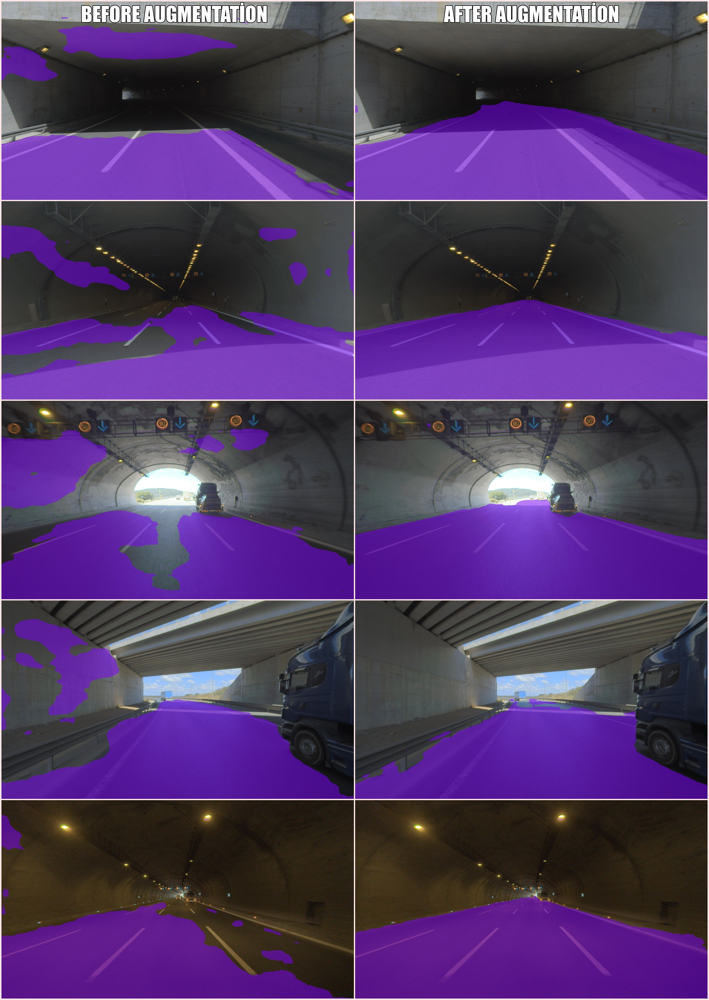
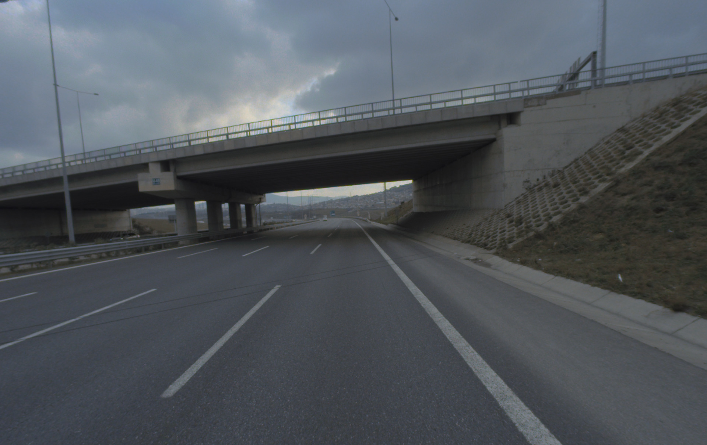
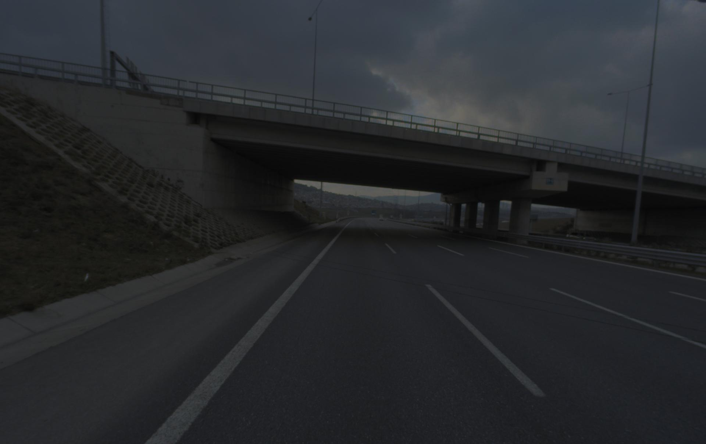
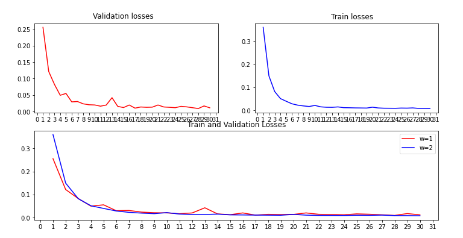

# Freespace Segmentation with Fully Convolutional Neural Network (FCNN)

In this project, I developed a deep learning project that detects drivable areas with pytorch and other libraries.


---
### Json To Mask
Each photo has a json file to create the masks. In this file, there is the "Freespace" class, which contains the pixel information of the drivable areas.
I have included an example json file below.
```sh
 {
            "id": 104780,
            "classId": 38,
            "description": "",
            "geometryType": "polygon",
            "labelerLogin": "",
            "createdAt": "2020-06-29T10:34:01.977Z",
            "updatedAt": "2020-08-10T06:55:10.683Z",
            "tags": [],
            "classTitle": "Freespace",
            "points": {
                "exterior": [
                    [
                        0,
                        1208
                    ],
                    [
                        0,
                        882
                    ],                   
                    [
                        1666,
                        586
                    ],
                    [
                        1722,
                        582
                    ],
                    [
                        893,
                        1208
                    ],
                    [
                        445,
                        1208
                    ]
                ],
                "interior": []
            }
        }
 ```
 With the help of the fillPoly function, I mask the data in the json file.
 ```sh
 
   for obj in json_dict["objects"]:
        if obj['classTitle']=='Freespace':
            mask = cv2.fillPoly(mask, np.array([obj['points']['exterior']]), color=1)
            
    cv2.imwrite(mask_path, mask.astype(np.uint8))
    
 ```
 ---
### Augmentation



I augmented the photos to improve the model. I changed the mirror image and brightness of the photos for this process
```sh
for image in tqdm.tqdm(train_input_path_list):
    
    img=Image.open(image) 
    img_aug = T.functional.adjust_brightness(img,brightness_factor=0.5)
    imgX = np.flip(img_aug, axis=1)
    new3_path=image[:-4]+"-1"+".jpg"
    new3_path=new3_path.replace('images', 'augmentation')
    imgX.save(new3_path)
   ```
   You can find the codes of this section from the [augmentation.py](https://github.com/emredemir98/Freespace_Segmentation_Project_-_Ford_Otosan/blob/main/src/augmentation.py) file.
| Original | Augmentation |
| ------ | ------ |
|||
---
### Train
I edited the parameters as below to train the data.
```sh
valid_size = 0.35
batch_size = 8
epochs = 30
cuda = True
input_shape = (224, 224)
n_classes = 2
 ```
 I preferred to use ADAM (Adaptive Moment Estimation) optimizer because it gives faster and better results.
```sh
model = UNet(n_channels=3, n_classes=2, bilinear=True)
criterion = nn.BCELoss()
optimizer = optim.Adam(model.parameters(), lr=0.0001)
 ```
 You can find the codes of this section from the [train.py](https://github.com/emredemir98/Freespace_Segmentation_Project_-_Ford_Otosan/blob/main/src/train.py) file.
 
 ---
### Results



